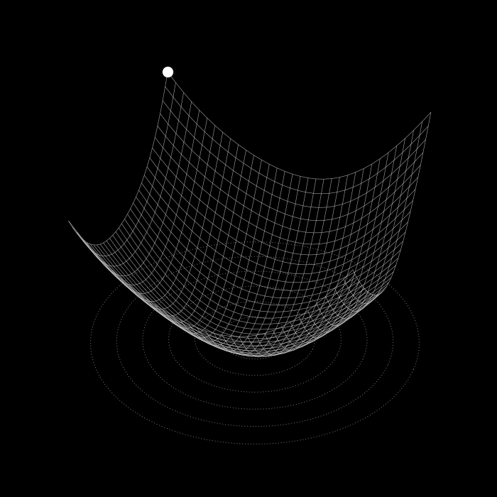

# Hi 👋, I'm Lê Thiên Hạo

<p align="left">  </p>

<table width="100%">
  <tr>
    <td width="70%" valign="top">

```python
class Me:
    def __init__(self):
        self.name = "Thien Hao"
        self.role = "Mathematics Enthusiast"
        self.location = "Ho Chi Minh City, Vietnam"
        self.skills = ["Python", "NumPy", "Docker"]
        self.github = "Znoywho"
    def introduce(self):
        return f"Hi, I'm {self.name}, a {self.role}."
me = Me()
print(me.introduce())
```
> *"The beauty of mathematics is not in the numbers, but in the patterns they reveal."*

  </td>
  <td width="30%" valign="top">



  </td>
  </tr>
</table>

- 🌱 I'm currently learning **Machine Learning
Deep Learning
Mathematics**

- 📫 How to reach me **znoywho1508@gamil.com**

- ⚡ Fun fact **I kinda like mathematics**

- 👨‍💻 All of my projects are available at **[https://github.com/Znoywho](https://github.com/Znoywho)**


# 🔗 Connect
<p align="center">
  <a href="https://github.com/Znoywho"></a>
  <a href="https://linkedin.com/in/LINK-CUA-BAN"></a>
  <a href="mailto:znoywho1508@gmail.com"></a>
</p>

# 🛠️ Tech Stack
<p align="center">
  
  
  
  
  
  
  
  
  
  
  <br />
  
  
  
  
  
  
  
  
  
  
  
  
</p>


# 📊 Training &amp; Convergence Stats

<p align="center">
  
</p>


<h3 align="left">Connect with me:</h3>
<p align="left">
<a href="https://github.com/Znoywho" target="blank"></a>
<a href="https://linkedin.com/in/Thien Hao" target="blank"></a>
</p>

<h3 align="left">Languages and Tools:</h3>


<p></p>

